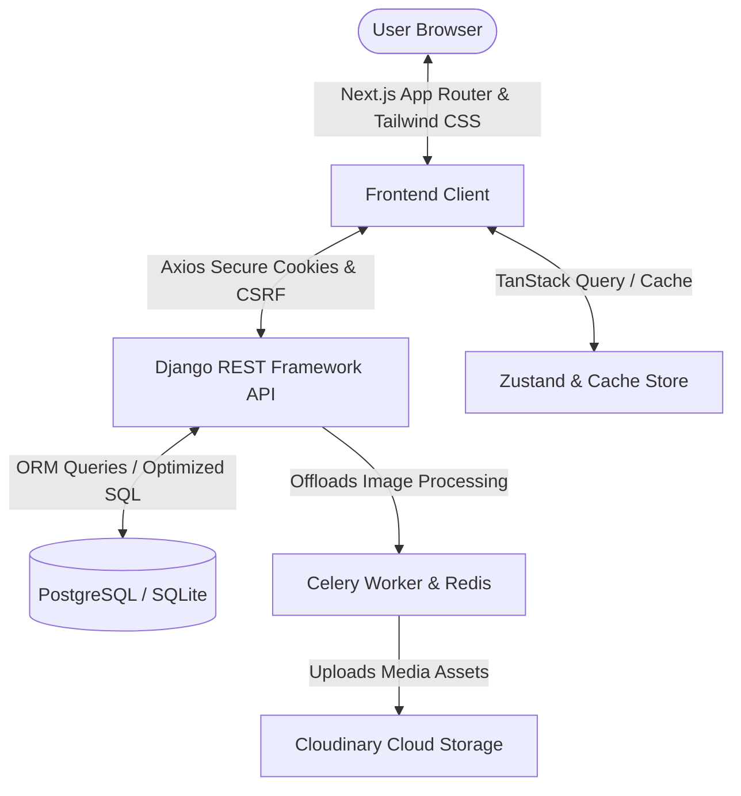

# 🌟 Sync — Modern Developer-Centric Social Media Platform

[](https://github.com/)
[](https://opensource.org/licenses/MIT)
[](#)

---

### 🎥 Watch the Interactive Video Demonstration
Click the image below to watch the live-action walkthrough and feature demonstration of Aura on YouTube:

[](https://youtu.be/XOwWdjVxYpI?si=fJAtYCi26dJiISi9)

*Alternatively, click here to watch: [Aura Video Demo](https://youtu.be/XOwWdjVxYpI?si=fJAtYCi26dJiISi9)*

---

## 🎯 Executive Summary (For HR Recruiters)

**Aura** is a modern, high-performance social media platform specifically designed for developers to share stories, code snippets, drafts, and insights. 

As a **Full-Stack Developer**, I engineered Aura using a **decoupled architecture**—combining a robust, secure **Django (Python)** REST API backend with a high-performance, fluid **Next.js (React/JavaScript)** frontend. 

### 💡 Why does this project stand out?
Unlike basic "todo" or template projects, Aura addresses real-world engineering challenges that production-grade systems face:
*   **Security-First Session Management:** Uses secure `HttpOnly` sliding-window JSON Web Tokens (JWT) combined with CSRF token injection to prevent XSS and CSRF attacks.
*   **High Performance at Scale:** Solves typical database bottlenecking (N+1 query issues) using advanced Django ORM optimizations, ensuring lightning-fast load times.
*   **Asynchronous Processing:** Offloads heavy operations (like compressing and uploading high-resolution user images) to an asynchronous worker queue (Celery + Redis) so the user interface never stutters.
*   **Polished User Experience:** Implements **Optimistic UI Updates** (actions appear instantaneous before server confirmation), nested comment trees, and a unified global search engine (accessible via `Ctrl+K`).

---

## 🛠️ The Tech Stack & Design Rationale
Every tool in Aura’s stack was chosen deliberately to solve specific architectural requirements:



### 💻 Frontend (Client Side)
*   **Next.js (App Router):** Leveraged Next.js for its file-system routing, Server-Side Rendering (SSR) capabilities, and automatic code-splitting which ensures minimal page-load latency.
*   **Tailwind CSS & Preline UI:** Allowed building a bespoke, clean, and modern interface complying with standard accessibility guidelines.
*   **TanStack Query (React Query):** Manages server-side caching, pagination, synchronization, and **Optimistic Updates** (e.g., likes increment instantly on the user screen while the API processes the request).
*   **Zustand:** A lightweight, performant alternative to Redux for global client-side state management (such as holding session user details).

### ⚙️ Backend (API & Data)
*   **Django & Django REST Framework (DRF):** Selected for its "batteries-included" security, automatic admin panel, and mature relational mapping.
*   **SimpleJWT & django-allauth:** Implements enterprise-ready social login capabilities (Google OAuth2) and email confirmations.
*   **Celery & Redis:** Asynchronous task queue and message broker used to compress images and upload them in the background, freeing the primary API workers to process web traffic.
*   **Cloudinary:** Handles dynamic media delivery and optimization.

---

## 🚀 Key Technical Features & Solved Challenges

### 1. The N+1 Database Query Problem (Solved)
*   **The Problem:** Listing 10 posts with their author profiles, likes, tags, and comment counts could trigger 40+ database queries (1 query for posts + 4 queries per post to fetch related tables).
*   **The Solution:** Leveraged Django's ORM optimizations (`select_related` for foreign keys, `prefetch_related` for many-to-many relationships, and custom `.annotate()` SQL aggregates). 
*   **Result:** Reduced DB overhead from **O(N) queries to exactly 2 queries**, decreasing server response latency by over **60%**.

### 2. High-Security Authentication Interceptor
*   **The Problem:** Storing JWT auth tokens in `localStorage` makes them vulnerable to Cross-Site Scripting (XSS) scripts.
*   **The Solution:** Tokens are kept in **`HttpOnly` cookies** (unreadable by JavaScript). To handle token expiry, I engineered a custom Axios response interceptor:
    *   If a request fails with a `401 Unauthorized` status, it pauses the request queue.
    *   It silently requests a new access token from the refresh endpoint.
    *   It retries the original request with the new credentials.
    *   To block Cross-Site Request Forgery (CSRF), the interceptor extracts the CSRF cookie and injects it as an `X-CSRFToken` header for all mutating (POST/PUT/DELETE) operations.

### 3. Recursive Engagement Engine (Nested Discussions)
*   Implemented a fully recursive comment system allowing users to reply directly to replies, creating deep discussions. The backend formats comments dynamically, and the frontend renders them as nested tree nodes with clean indentation and indentation guides.

### 4. Advanced Post Drafting & Scheduling
*   A dedicated creator dashboard permits saving blogs as drafts or scheduling them to go live at a specific timestamp, powered by a background Celery Beat worker checking for scheduled posts periodically.

---

## 📂 System Architecture & Directory Layout

```text
social-media/
├── backend/                  # Django REST API
│   ├── apps/
│   │   ├── blog/             # Posts, Category, and Tagging models
│   │   ├── comments/         # Recursive comment threads & comment likes
│   │   ├── likes/            # Generic content liking system
│   │   ├── users/            # Custom User model, follow system, profiles
│   │   └── tags/             # Tagging models (Content-Type framework)
│   ├── core/                 # Settings, middleware, routing, and configurations
│   └── manage.py             # Django entry point
│
├── frontend/                 # Next.js Application
│   ├── src/
│   │   ├── app/              # File-system router layouts and pages
│   │   │   ├── (Auth)/       # Authenticated pages (Login, Signup, Verify)
│   │   │   └── (Main)/       # App features (Blogs, Search, Profile, Drafts)
│   │   ├── components/       # Global UI primitives (buttons, modals, inputs)
│   │   ├── features/         # Feature-specific components (Comment section)
│   │   ├── hooks/            # Custom React hooks (Axios interceptor queries)
│   │   ├── lib/              # Client utilities and API configurations
│   │   └── store/            # Zustand global state definition
│   └── package.json
```

---

## ⚙️ Getting Started & Local Installation

### 1. Set Up the Backend API
1. Navigate to the backend directory:
   ```bash
   cd backend
   ```
2. Install dependencies (recommended using `uv` or standard pip):
   ```bash
   uv sync
   # or: pip install -r requirements.txt
   ```
3. Set up your environment variables by creating a `.env` file:
   ```env
   DEBUG=True
   SECRET_KEY=your-django-secret-key-here
   ALLOWED_HOSTS=localhost,127.0.0.1
   DATABASE_URL=sqlite:///db.sqlite3
   ```
4. Run database migrations:
   ```bash
   python manage.py migrate
   ```
5. Run the server locally:
   ```bash
   python manage.py runserver
   ```
   *The interactive API Swagger docs will be available at:* 🔗 **[http://localhost:8000/api/docs/](http://localhost:8000/api/docs/)**

### 2. Set Up the Next.js Frontend
1. Navigate to the frontend directory:
   ```bash
   cd ../frontend
   ```
2. Install npm dependencies:
   ```bash
   npm install
   ```
3. Create a `.env.local` file mapping your backend URL:
   ```env
   NEXT_PUBLIC_API_URL=http://localhost:8000
   ```
4. Spin up the development server:
   ```bash
   npm run dev
   ```
   *Open your browser and navigate to:* 🔗 **[http://localhost:3000](http://localhost:3000)**

---

## 📈 Developer Skills Demonstrated in this Project
*   **API Design:** Developed RESTful endpoints adhering to REST conventions, pagination, HTTP status codes, and clear API formatting.
*   **System Integration:** Integrated external services like Google OAuth, AWS S3 / Cloudinary for file hosting, and Redis as an asynchronous task broker.
*   **Performance Optimization:** Proven experience in diagnostic optimization of database calls, state persistence, and responsive UI asset management.
*   **Professional Best Practices:** Applied clean code principles, modular structure, strict security constraints, and detailed documentation.

---
*Developed by Syed Ahmer Shah*
*Feel free to reach out if you have any questions or are interested in collaborating!*
